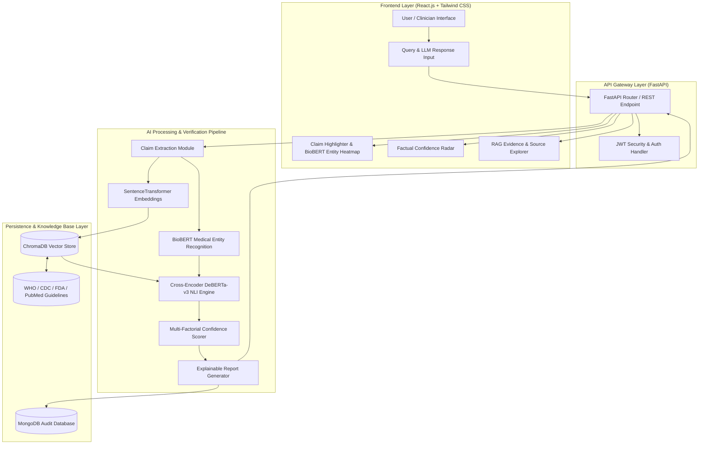
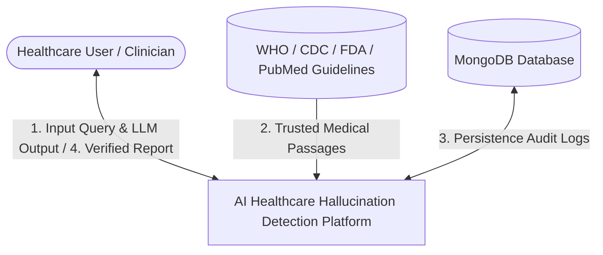
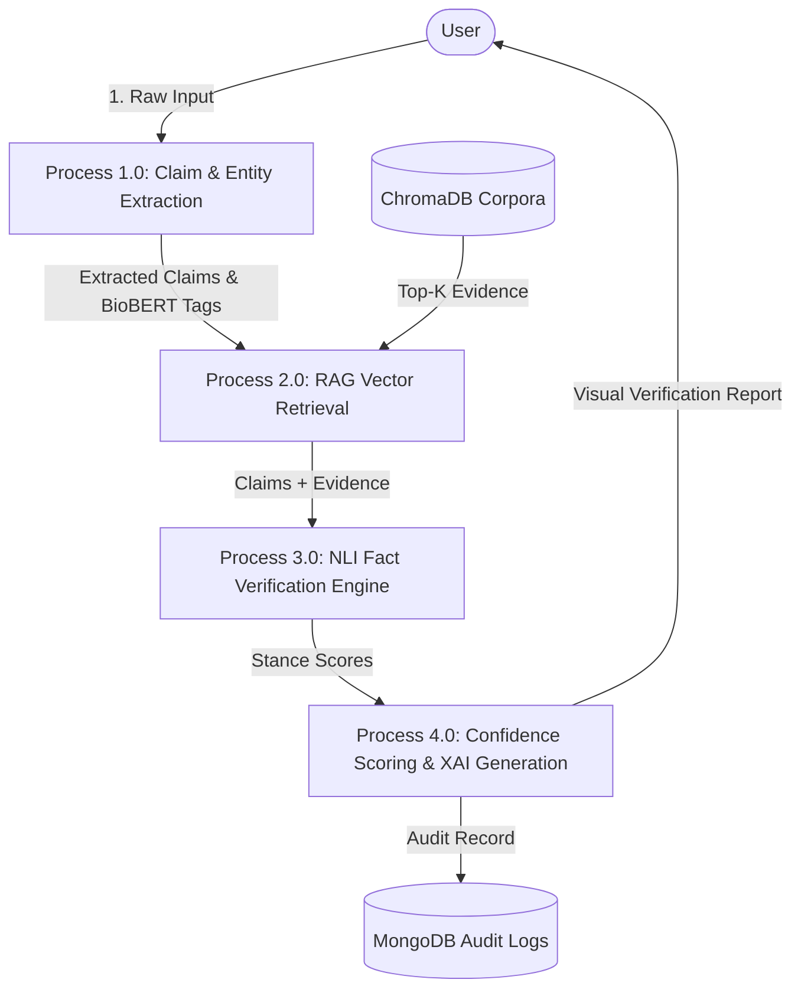
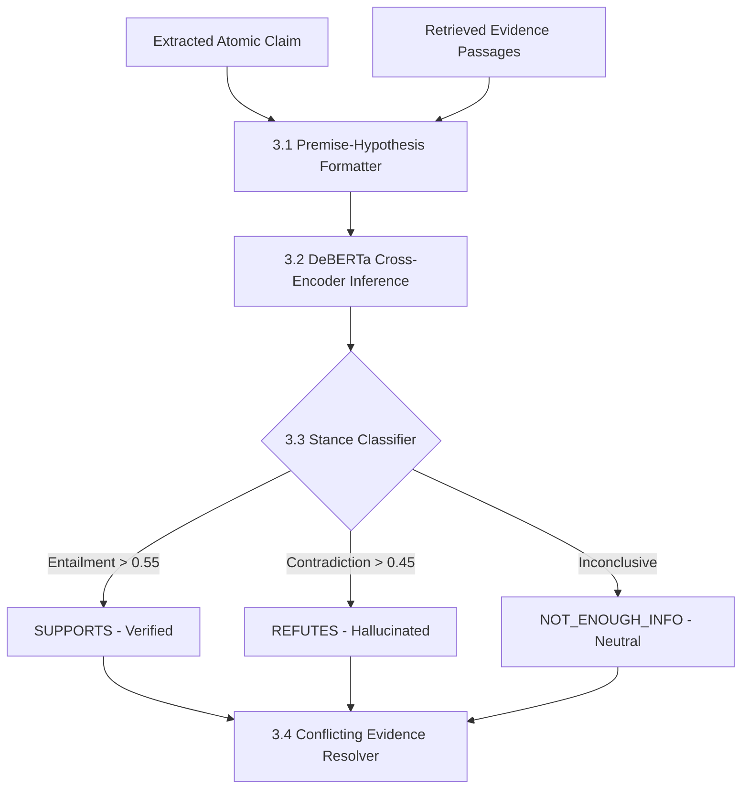

# System Architecture & Data Flow Diagrams (DFD)

## 1. System Architecture Diagram

---

## 2. Data Flow Diagrams (DFD)

### DFD Level 0 (Context Diagram)

### DFD Level 1 (Macro Process Breakdown)

### DFD Level 2 (Detailed Fact Verification Sub-process)

