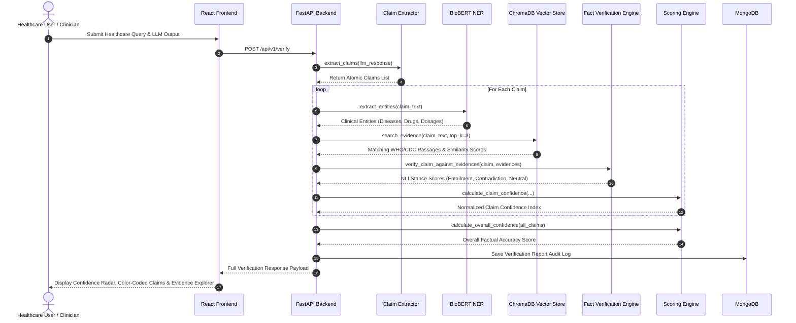

# UML Class, Component & Sequence Diagrams

## 1. UML Class Diagram

```mermaid
classDiagram
    class FastAPIApp {
        +verify_llm_response(payload)
        +verify_single_claim(payload)
    }

    class MedicalClaimExtractor {
        +extract_claims(text) List~Dict~
        -_is_factual_assertion(sentence) bool
        -_categorize_claim(claim_text) String
    }

    class BioBERTMedicalNER {
        +extract_entities(text) List~Dict~
        -_lazy_init()
    }

    class HealthcareVectorStore {
        +search_evidence(claim_text, top_k) List~Dict~
        +initialize()
    }

    class FactVerificationEngine {
        +verify_claim_against_evidences(claim, evidences) Dict
        -_compute_nli(premise, hypothesis) Dict
    }

    class ConfidenceScoringAlgorithm {
        +calculate_claim_confidence(verdict, sim, entail, contradict, evidences) float
        +calculate_overall_confidence(claim_results) float
    }

    class ExplainableAIEngine {
        +generate_claim_explanation(claim, verdict, conf, evidences) String
        +generate_summary_report(query, total, hallucinated, conf, details) String
    }

    FastAPIApp --> MedicalClaimExtractor
    FastAPIApp --> BioBERTMedicalNER
    FastAPIApp --> HealthcareVectorStore
    FastAPIApp --> FactVerificationEngine
    FastAPIApp --> ConfidenceScoringAlgorithm
    FastAPIApp --> ExplainableAIEngine
```

---

## 2. Sequence Diagram (Verification Execution Flow)

```mermaid
sequenceDiagram
    autonumber
    actor User as Healthcare User / Clinician
    participant UI as React Frontend
    participant API as FastAPI Backend
    participant Ext as Claim Extractor
    participant NER as BioBERT NER
    participant Vector as ChromaDB Vector Store
    participant NLI as Fact Verification Engine
    participant Score as Scoring Engine
    participant DB as MongoDB

    User->>UI: Submit Healthcare Query & LLM Output
    UI->>API: POST /api/v1/verify
    API->>Ext: extract_claims(llm_response)
    Ext-->>API: Return Atomic Claims List
    
    loop For Each Claim
        API->>NER: extract_entities(claim_text)
        NER-->>API: Clinical Entities (Diseases, Drugs, Dosages)
        API->>Vector: search_evidence(claim_text, top_k=3)
        Vector-->>API: Matching WHO/CDC Passages & Similarity Scores
        API->>NLI: verify_claim_against_evidences(claim, evidences)
        NLI-->>API: NLI Stance Scores (Entailment, Contradiction, Neutral)
        API->>Score: calculate_claim_confidence(...)
        Score-->>API: Normalized Claim Confidence Index
    end

    API->>Score: calculate_overall_confidence(all_claims)
    Score-->>API: Overall Factual Accuracy Score
    API->>DB: Save Verification Report Audit Log
    API-->>UI: Full Verification Response Payload
    UI-->>User: Display Confidence Radar, Color-Coded Claims & Evidence Explorer
```
